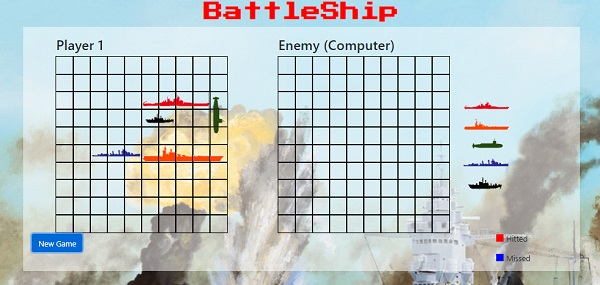
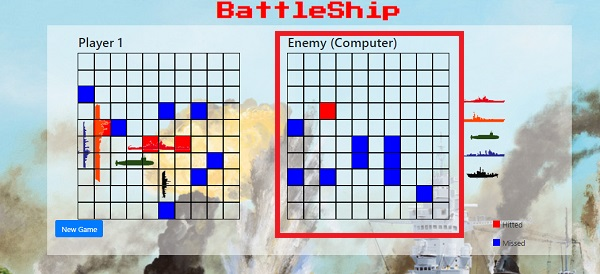
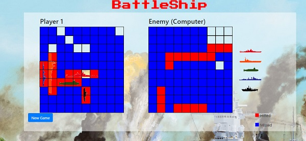
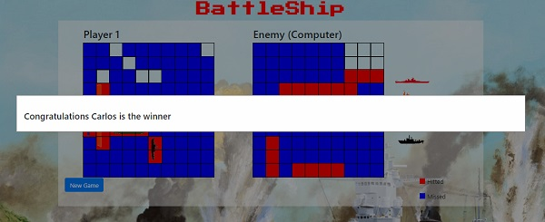
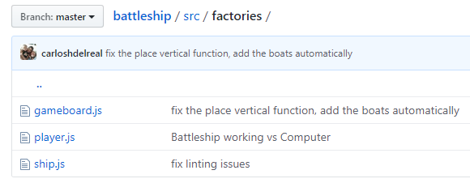
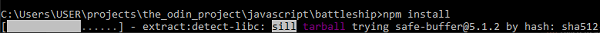
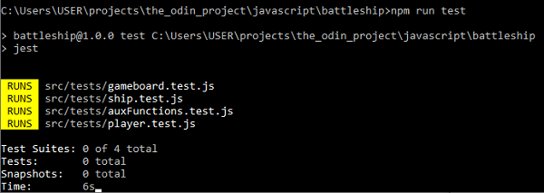
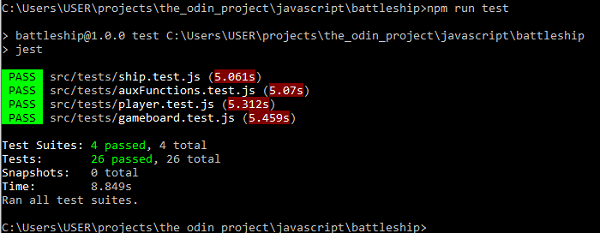

# Battleship

The Best Battleship game ever!!

**Battleship** is an implementation of the Battleship game, made using the methodology and instrucctions of [The Oding Project](https://www.theodinproject.com). This project ask us to implement an test the different modules and factories that compose the game, you can click [here](https://www.theodinproject.com/courses/javascript/lessons/battleship?ref=lnav) to see the project requirements.

The project will be reviewed and approved by a **TSE** from [Microverse](https://microverse.org)

## Tools used

In this project we used:

- HTML
- CSS
- JavaScript
- Bootstrap
- Webpack
- ESLint
- NPM
- Pretty

# Author

This project was created by:

- Carlos Del Real [Github Account https://github.com/carloshdelreal](https://github.com/carloshdelreal)
- António Fernandes [Github account https://github.com/trox115](https://github.com/trox115)

# Live Version

You can find the development's live version of this project [here](https://raw.githack.com/carloshdelreal/battleship/develop/dist/index.html)

You can find the stable version of this project [here](https://carloshdelreal.github.io/battleship/dist/index.html)

# License

All the source code in the [The Odin Project](https://www.theodinproject.com/courses/javascript/lessons/weather-app) is available jointly under the MIT License and the Beerware License.

## Used Commands

- npm init
- npm install eslint --save-dev
- npm install prettier --save-dev
- ./node_modules/.bin/eslint --init
- //configure the options
- npm install webpack webpack-cli --save-dev
- npx webpack
- npm run watch
- npm run lint

# Running Guide

to get a running version of this project on your machine you have to install node and then follow the instructions, for installing Node go to the [node Oficial site https://nodejs.org/](https://nodejs.org/) and follow the installation instructions

```Shell
your@pc:~$ git clone https://github.com/carloshdelreal/battleship.git
your@pc:~$ cd battleship
your@pc:~$ npm install
your@pc:~$ npm run watch

```
open up the `./dist/index.html` file on you browser and voila!

## Game Features

To start the game, simply click the Game Start button, and your boats will appear automatically. They will be placed randomly every time you click Game Start

<figure class="figure">
    
</figure>

Now you are ready to start firing!! Click the squares on the enemy board that you’d like to fire on. Every time you fire, the enemy will fire back.

<figure class="figure">
    
</figure>

Fire until the end, up to the last boat!

<figure class="figure">
    
</figure>

Once you have sunk all the enemy boats or your enemy has destroyed all of yours, you will see a victory or loss message.

<figure class="figure">
    
</figure>

## The coding Background

This project uses a series of techniques for modularizing the code. It uses Object oriented programming, and more specifically factory functions, to emulate classes on JavaScript and create the code as loosely-coupled as possible.

<figure class="figure">
    
</figure>

As a result, you can see at the folder structure that each of the folders correspond to any object that can be reused in the implementation of a similar game. In addition, the application of SOLID principles makes the code much more readable and easy to learn and understand. If you want to learn more about [Solid Principles](https://medium.com/@carloshdelreal/stop-coding-bad-practices-d976ce05dbc6){:target="_blank"} checkout an article that I have written about it.

## Testing

For this project was used jest as a testing framework, if you want a local copy of this project just follow the [Battleship Game Repository](https://github.com/carloshdelreal/battleship){:target="_blank"}.Navigate to your repository folder and type `npm install`. You will see the following:

<figure class="figure">
    
</figure>

Then you can check the testing results by typing `npm run test` Your results will look something like this:

<figure class="figure">
    
</figure>

Once all tests pass, you will see:

<figure class="figure">
    
</figure>
